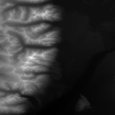
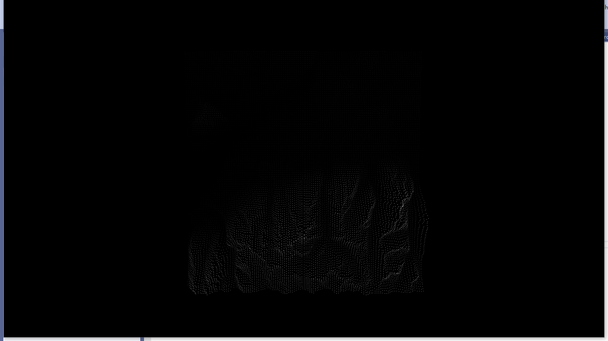
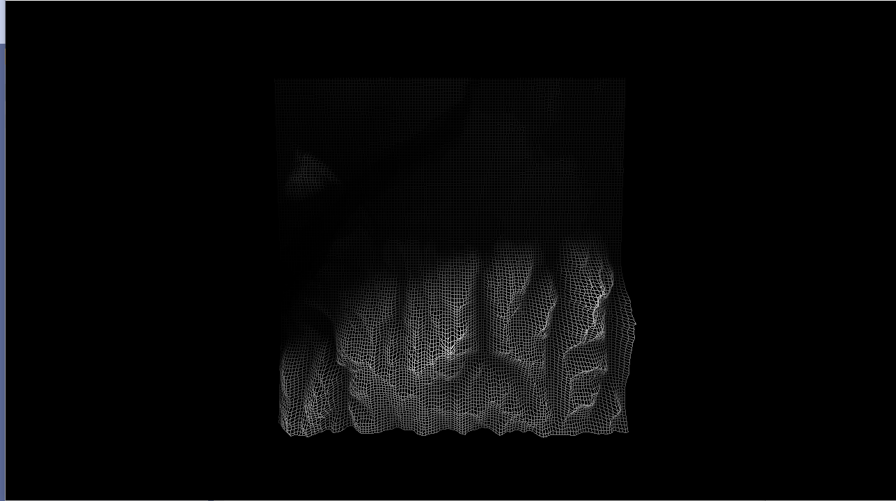
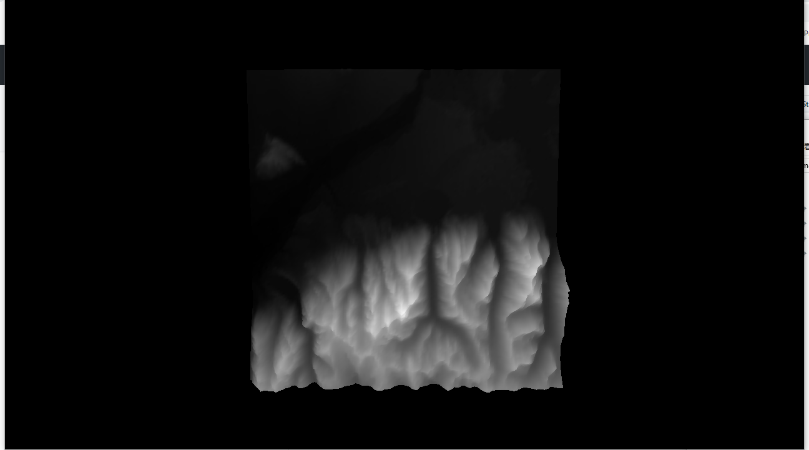
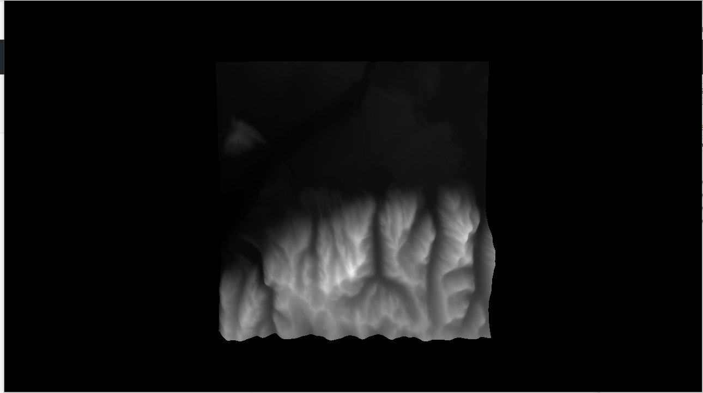
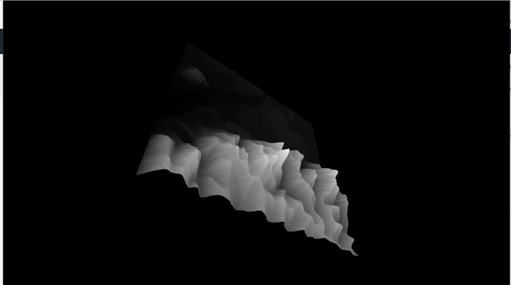
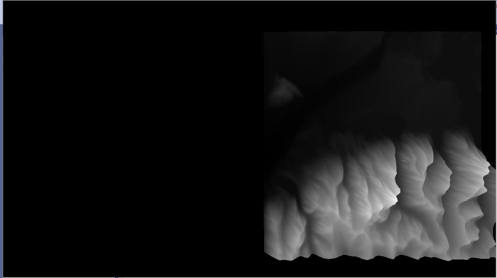
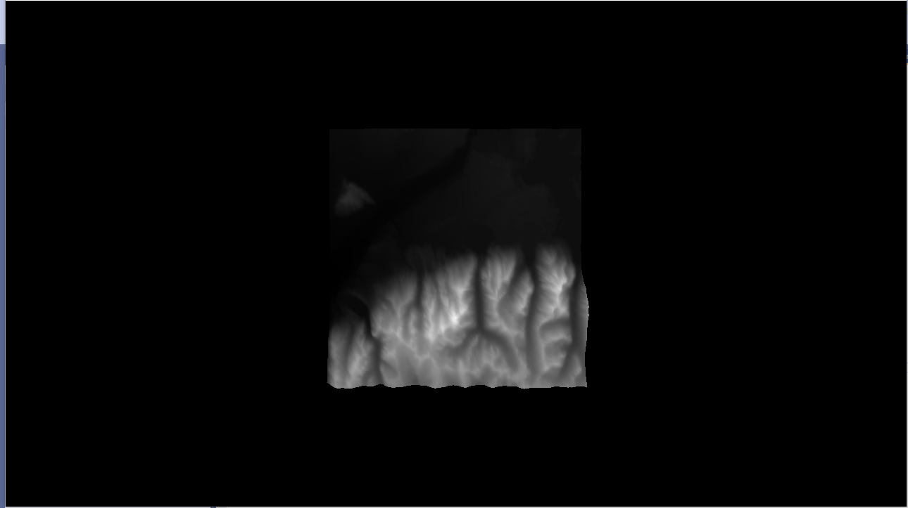

# heightmap
A 3d height field based on the data from image using shader-based OpenGL

This project is the first assignment of my Computer Graphics course. It is established on Windows platform using Visual Studio 2019. The project files are in ./hw1.

In this project, the main purpose is to create a three dimensional height field based on the data from 2D image. 
Mode 1: point
Mode 2: wireframe
Mode 3: solid triangles
Mode 4: smooth
Four different modes can be chosen by pressing key "1", "2", "3" or "4" correspondingly. 

The following is an exmaple.

 

Take the above heightmap figure as an imput. Then Compile and Run. We will have the following four different scences.
Mode 1:

 

Mode 2:

 

Mode 3:

 

Mode 4:

 

For control: 
Left Mouse Botton is used to rotate.

 

Ctrl + Left Mouse Button is used for translate.

 

Ctrl + Middle Mouse Button is used for scale.

 

